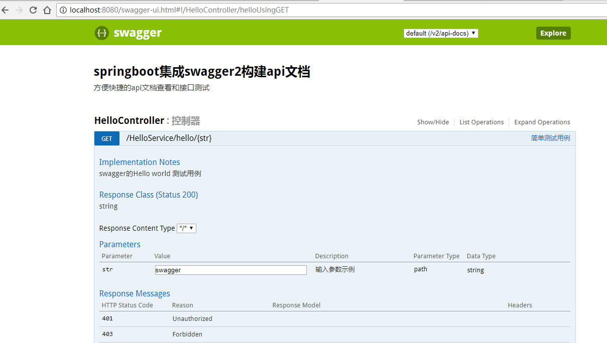

#springboot集成swagger2
springboot提供了简单方便的swagger集成方式
##引入依赖
```
<dependency>
	<groupId>io.springfox</groupId>
	<artifactId>springfox-swagger2</artifactId>
	<version>2.6.1</version>
</dependency>

<dependency>
	<groupId>io.springfox</groupId>
	<artifactId>springfox-swagger-ui</artifactId>
	<version>2.6.1</version>
</dependency>
```
##编写swagger2配置类
新建配置类SwaggerConfig(注意此类需和springboot启动类在同一目录),代码如下,  
需要注意的是apis需配置要扫描的controller包的路径.
```
@Configuration
@EnableSwagger2
public class SwaggerConfig {
    @Bean
    public Docket createRestApi() {
        return new Docket(DocumentationType.SWAGGER_2)
                .apiInfo(apiInfo())
                .select()
                .apis(RequestHandlerSelectors.basePackage("com.example.springBootswaggerdemo.controller"))
                .paths(PathSelectors.any())
                .build();
    }

    private ApiInfo apiInfo() {
        return new ApiInfoBuilder()
                .title("springboot集成swagger2构建api文档")
                .description("方便快捷的api文档查看和接口测试")
                .termsOfServiceUrl("http://hello.com")
                .version("1.0")
                .build();
    }
}
```
使用注解@EnableSwagger2 表示开启Swagger
##restful 接口
使用springmvc注解发布restful接口,再使用swagger的api注解对接口进行说明.  
最后启动springboot,访问http://localhost:8080/swagger-ui.html,对接口进行查看和测试.  

##swagger注解说明
@Api：修饰整个类，描述Controller的作用
@ApiOperation：描述一个类的一个方法，或者说一个接口
@ApiParam：单个参数描述
@ApiModel：用对象来接收参数
@ApiProperty：用对象接收参数时，描述对象的一个字段
@ApiResponse：HTTP响应其中1个描述
@ApiResponses：HTTP响应整体描述
@ApiIgnore：使用该注解忽略这个API
@ApiError ：发生错误返回的信息
@ApiImplicitParam：一个请求参数
@ApiImplicitParams：多个请求参数
