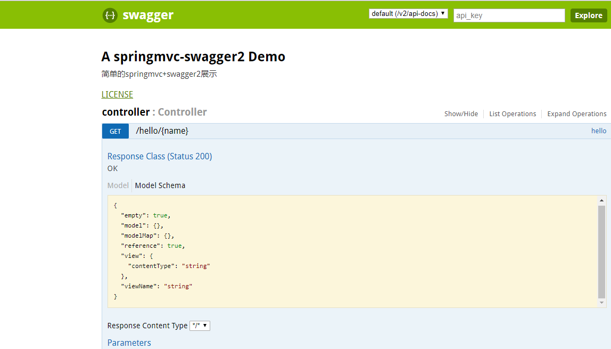

# springmvc集成swagger2
swagger是一个方便快捷的API生成工具，swagger2是swagger项目的最新版本，
具体可见[swagger项目](https://github.com/swagger-api/swagger-ui)。
本示例提供了一个简单的springmvc+swagger2的集成demo。
## 引入swagger2依赖
```
<dependencies>
    <!--swagger start-->
    <dependency>
      <groupId>io.springfox</groupId>
      <artifactId>springfox-swagger2</artifactId>
      <version>${swagger.version}</version>
    </dependency>
    <dependency>
      <groupId>io.springfox</groupId>
      <artifactId>springfox-swagger-ui</artifactId>
      <version>${swagger.version}</version>
    </dependency>
    <!-- https://mvnrepository.com/artifact/com.fasterxml.jackson.core/jackson-core -->
    <dependency>
      <groupId>com.fasterxml.jackson.core</groupId>
      <artifactId>jackson-core</artifactId>
      <version>${jackson.version}</version>
    </dependency>
    <!-- https://mvnrepository.com/artifact/com.fasterxml.jackson.core/jackson-databind -->
    <dependency>
      <groupId>com.fasterxml.jackson.core</groupId>
      <artifactId>jackson-databind</artifactId>
      <version>${jackson.version}</version>
    </dependency>
    <!-- https://mvnrepository.com/artifact/com.fasterxml.jackson.core/jackson-annotations -->
    <dependency>
      <groupId>com.fasterxml.jackson.core</groupId>
      <artifactId>jackson-annotations</artifactId>
      <version>${jackson.version}</version>
    </dependency>
    <!--swagger end-->
  </dependencies>
```
## 配置swagger2
新建一个swagger2配置类
```
package com.springmvc.config;

import org.springframework.context.annotation.Bean;
import org.springframework.context.annotation.Configuration;
import springfox.documentation.builders.ApiInfoBuilder;
import springfox.documentation.builders.PathSelectors;
import springfox.documentation.builders.RequestHandlerSelectors;
import springfox.documentation.service.ApiInfo;
import springfox.documentation.spi.DocumentationType;
import springfox.documentation.spring.web.plugins.Docket;
import springfox.documentation.swagger2.annotations.EnableSwagger2;

import java.util.ArrayList;
import java.util.List;

/**
 * Created by lzp on 2017/9/6.
 */
@Configuration
@EnableSwagger2
public class Swagger2Config {
    @Bean
    public Docket api(){
        return new Docket(DocumentationType.SWAGGER_2)
                .select()
                .apis(RequestHandlerSelectors.any())
//                .paths(PathSelectors.regex("/api/.*"))    //选择api/路径下的api展示
                .paths(PathSelectors.any())
                .build()
                .apiInfo(apiInfo());
    }

    private ApiInfo apiInfo() {
        return new ApiInfoBuilder()
                .title("A springmvc-swagger2 Demo")
                .description("简单的springmvc+swagger2展示")
                .version("v1.0")
                .termsOfServiceUrl("http://terms-of-services.url")
                .license("LICENSE")
                .licenseUrl("http://url-to-license.com")
                .build();
    }

}
```
## 集成springmvc
 DispatcherServlet的xml配置如下：
```
 <!--映射swagger2静态资源-->
 <mvc:resources location="classpath:/META-INF/resources/" mapping="swagger-ui.html"/>
 <mvc:resources location="classpath:/META-INF/resources/webjars/" mapping="/webjars/**"/>
```
## swagger-ui 展示
启动项目后，访问地址http://host:port/projectName/swagger-ui.html,
即可看到生成的API页面，同时通过地址http://host:port/projectName/v2/api-docs
可得到API的json数据。
